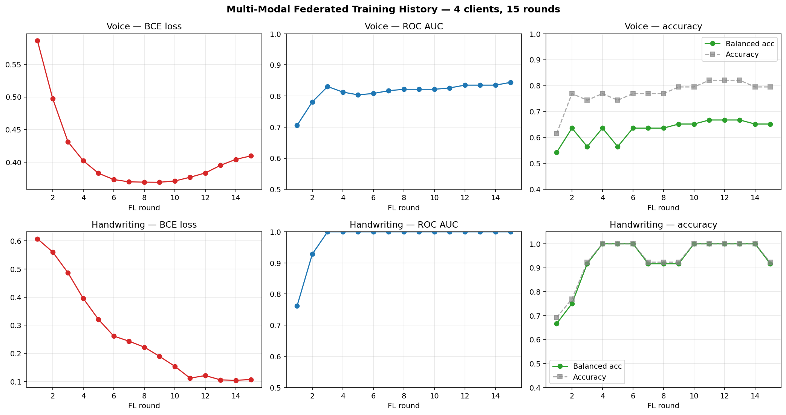
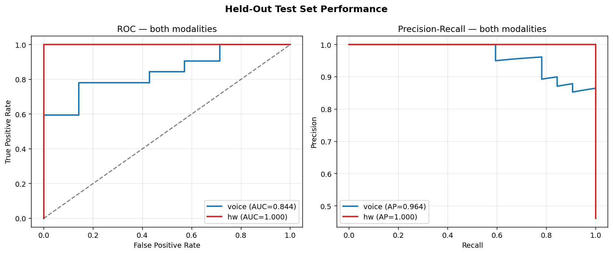
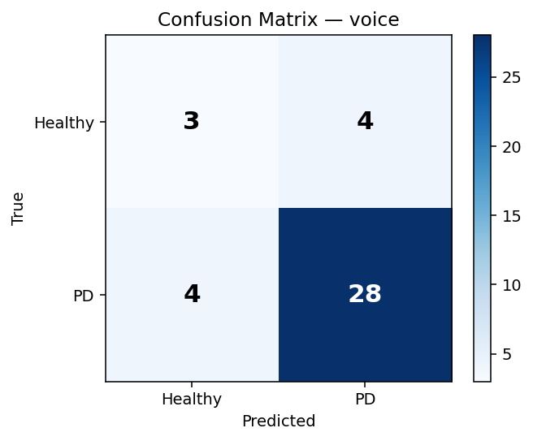
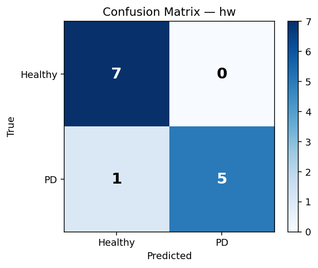
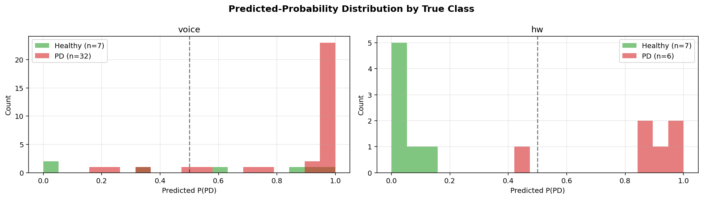
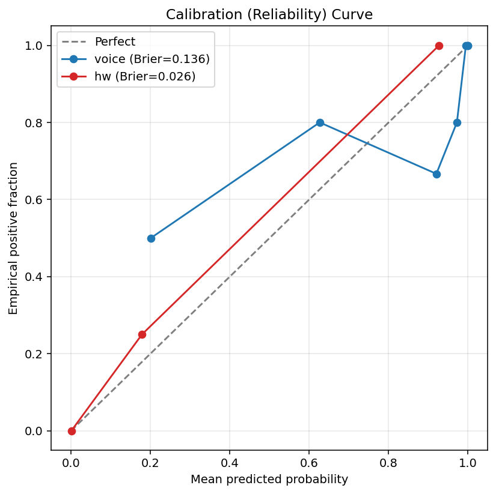
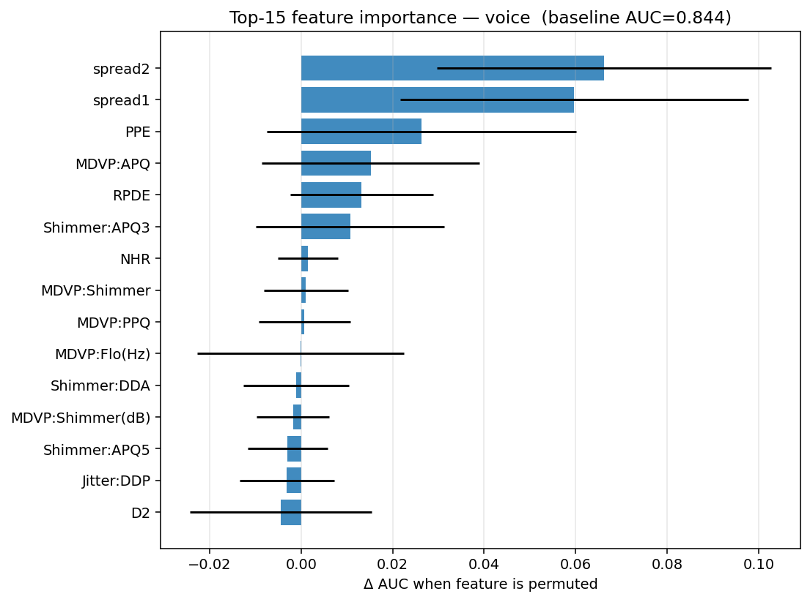
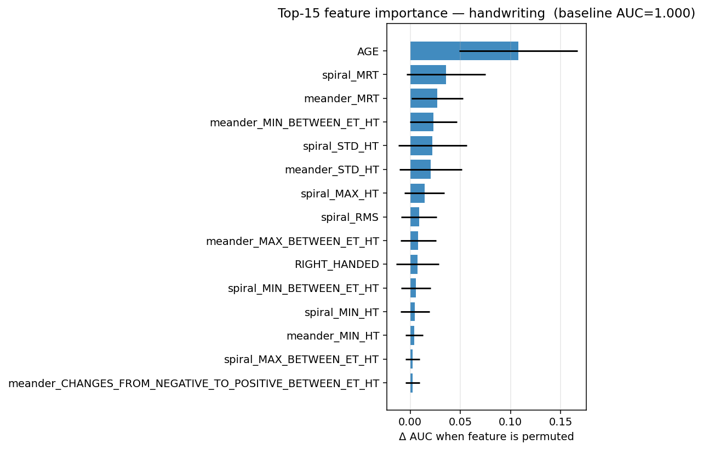

<div align="center">

# 🧠 Federated Learning for Parkinson's Disease Detection

### Multi-Modal Privacy-Preserving Early Detection using Voice & Handwriting Biomarkers

[](https://python.org)
[](LICENSE)
[](tests/test_pipeline.py)
[](app/app.py)
[](https://sdgs.un.org/goals/goal3)
[](https://pec.ac.in)

<br/>

> **Federated Learning** allows hospitals to collaboratively train an AI model for Parkinson's Detection **without sharing any patient data**. Each hospital keeps its data private — only model weights are exchanged.

<br/>

| 🗣️ Voice (UCI) | ✍️ Handwriting (NewHandPD) | 📈 UPDRS Regression |
|:---:|:---:|:---:|
| **AUC: 0.844** | **AUC: 1.000** | **MAE: 7.96** |
| Accuracy: 79.5% | Accuracy: 92.3% | RMSE: 9.83 |
| F1: 0.875 | F1: 0.909 | Motor UPDRS |

</div>

---

## 📋 Table of Contents

- [Problem Statement](#-problem-statement)
- [What is Federated Learning?](#-what-is-federated-learning)
- [Datasets](#-datasets)
- [Architecture](#-architecture)
- [Results](#-results)
- [Project Structure](#-project-structure)
- [Quick Start](#-quick-start)
- [Dashboard](#-dashboard)
- [Tests](#-tests)
- [SDG Mapping](#-sdg-mapping)
- [Team](#-team)
- [References](#-references)

---

## 🎯 Problem Statement

Parkinson's Disease (PD) affects **10+ million people** worldwide. The biggest challenge is **late diagnosis** — by the time classic tremors and rigidity appear, 60–80% of dopamine-producing neurons are already destroyed.

**Two core challenges this project addresses:**

1. **Early Detection** — Can AI detect PD from non-invasive signals (voice, handwriting) before motor symptoms are severe?
2. **Data Privacy** — Hospitals cannot share patient records due to privacy regulations (HIPAA, GDPR). How can multiple hospitals collaborate to train a better model without exposing sensitive data?

**Our Solution:** A federated learning system where 4 hospital clients train on their own private data and contribute only model weights to a shared global model — across **2 modalities** (voice + handwriting) simultaneously.

---

## 🌐 What is Federated Learning?

```
Traditional (Centralized) — ❌ Privacy Risk
─────────────────────────────────────────────
Hospital A data ──────────►
Hospital B data ──────────►  Central Server  →  Model
Hospital C data ──────────►  (all raw data)
Raw patient records leave the hospital!


Federated Learning — ✅ Privacy Preserved
─────────────────────────────────────────────
Hospital A trains locally → sends weights ──►
Hospital B trains locally → sends weights ──►  Server aggregates  →  Global Model
Hospital C trains locally → sends weights ──►  (no raw data ever)
Patient data NEVER leaves the hospital.
```

### FedProx Algorithm

We use **FedProx** (Li et al., 2020) instead of vanilla FedAvg. FedProx adds a proximal term to each client's local loss:

```
Local Loss = Task Loss  +  (μ/2) × ||w − w_global||²
```

This prevents any single hospital from drifting too far from the global model — critical when hospitals have different class distributions (Non-IID data). We use **μ = 0.1**.

### Modality-Aware Aggregation (Our Contribution)

Standard FedProx assumes all clients share the same feature space. Our hospitals do not — Hospital 4 has handwriting data, Hospitals 1–3 have voice data. We implement **per-key weighted aggregation**:

```
voice_encoder  →  averaged over Hospital 1, 2, 3 only  (sample-weighted)
hw_encoder     →  copied directly from Hospital 4       (sole owner)
shared head    →  averaged over ALL 4 hospitals          (cross-modal transfer)
```

The shared head enables **cross-modal knowledge transfer** — both kinds of hospitals train the same downstream classifier, so each modality benefits from the other's training signal.

---

## 📊 Datasets

All datasets are **real, publicly available** research datasets. No synthetic data used.

| # | Dataset | Source | Patients | Samples | Modality | Task |
|---|---------|--------|----------|---------|----------|------|
| 1 | **UCI Parkinson's Voice** | Little et al., 2009 | 31 subjects | 195 voice records | 22 acoustic features | Binary classification |
| 2 | **NewHandPD** | Pereira et al., UNESP | 63 (35 healthy, 28 PD) | 264 exams | Spiral + meander kinematics | Binary classification |
| 3 | **Oxford Telemonitoring** | Tsanas et al., 2010 | 42 PD patients | 5,875 recordings | Voice (longitudinal) | UPDRS regression |

### Data Split (Patient-Aware — No Leakage)

```
UCI Voice:
  Hospital 1  →  52 patients  (37 PD, 15 healthy)
  Hospital 2  →  52 patients  (39 PD, 13 healthy)
  Hospital 3  →  52 patients  (39 PD, 13 healthy)
  Test set    →  39 patients  (32 PD,  7 healthy)

NewHandPD:
  Hospital 4  →  50 patients  (22 PD, 28 healthy)
  Test set    →  13 patients  ( 6 PD,  7 healthy)

Oxford Telemonitoring:
  Training    →  4,577 recordings  |  33 subjects
  Test        →  1,298 recordings  |   9 subjects
```

---

## 🏗️ Architecture

```
┌──────────────────────────────────────────────────────────────────────────────┐
│                           FEDERATED SERVER                                   │
│              (Modality-Aware FedProx Aggregator — 15 rounds)                 │
│   voice_encoder ← avg(H1,H2,H3)  │  hw_encoder ← H4  │  head ← avg(ALL)    │
└──────────────────────┬───────────────────────────────────────────────────────┘
                       │  exchange weights only (no patient data)
       ┌───────────────┼─────────────────┬──────────────────────┐
       ▼               ▼                 ▼                      ▼
┌────────────┐  ┌────────────┐  ┌────────────┐       ┌──────────────────┐
│ Hospital 1 │  │ Hospital 2 │  │ Hospital 3 │       │   Hospital 4     │
│ 52 patients│  │ 52 patients│  │ 52 patients│       │   50 patients    │
│  (voice)   │  │  (voice)   │  │  (voice)   │       │  (handwriting)   │
└─────┬──────┘  └─────┬──────┘  └─────┬──────┘       └────────┬─────────┘
      │               │               │                        │
┌─────▼──────────────────────────┐            ┌───────────────▼──────────┐
│         Voice Encoder          │            │      Handwriting Encoder  │
│   Linear(22→64) → ReLU →       │            │   Linear(21→64) → ReLU → │
│   Dropout(0.3) → Linear(64→32) │            │   Dropout(0.3)→ Linear   │
└─────────────────┬──────────────┘            │   (64→32)                │
                  └───────────────┬────────────┘
                                  ▼
                    ┌─────────────────────────┐
                    │      Shared Head         │
                    │  Linear(32→16) → ReLU   │
                    │  → Dropout → Linear(16→1)│
                    └────────────┬────────────┘
                                 ▼
                        PD Risk Score [0, 1]
```

### Hyperparameters

| Parameter | Value |
|---|---|
| FL Rounds | 15 |
| Local Epochs per Round | 3 |
| Batch Size | 16 |
| Learning Rate | 0.001 (Adam) |
| FedProx μ | 0.1 |
| Dropout | 0.3 |
| Embedding Dim | 32 |
| DP Clip Norm (optional) | 1.0 |
| DP Noise Multiplier (optional) | 0.5 |

---

## 📈 Results

### Training Curves (15 Rounds, 4 Clients)



*Voice AUC improves steadily from 0.69 → 0.844. Handwriting loss drops to near-zero by round 5, AUC reaches 1.0.*

### ROC & Precision-Recall Curves



### Final Performance on Held-Out Test Sets

| Modality | Test Patients | AUC | Accuracy | Balanced Acc | F1 | Brier Score |
|---|---|---|---|---|---|---|
| 🗣️ **Voice** | 39 | **0.844** | 79.5% | 65.2% | 0.875 | 0.122 |
| ✍️ **Handwriting** | 13 | **1.000** | 92.3% | 91.7% | 0.909 | — |

### Confusion Matrices

| Voice | Handwriting |
|:---:|:---:|
|  |  |

### Predicted Probability Distributions



*Green = Healthy patients cluster near 0. Red = PD patients cluster near 1. Clean class separation in both modalities.*

### Calibration Curve



*Brier Score 0.122 — well-calibrated predictions (0.0 = perfect, 0.25 = random coin flip).*

### Feature Importance (Permutation-Based)

| Voice | Handwriting |
|:---:|:---:|
|  |  |

**Voice:** `spread2`, `spread1`, `PPE` dominate — non-linear dynamical complexity measures. Consistent with published literature (Little 2009, Tsanas 2010).

**Handwriting:** `AGE` is the strongest predictor (known confounder — handwriting slows with age), followed by `spiral_MRT` (mean relative tremor) and `meander_STD_HT` — genuine motor symptom features.

### UPDRS Severity Regression

| Target | MAE | RMSE | Context |
|---|---|---|---|
| motor_UPDRS | **7.96** | 9.83 | Scale: 0–44 |
| total_UPDRS | **9.34** | 11.52 | Scale: 0–54 |

> **On the negative R²:** The strict patient-aware split means the model never sees a test subject during training. Within-patient UPDRS variance is only ~2.7 points over 6 months, but between-patient variance is ~8.2 points. MAE ~8 matches Tsanas et al. (2010)'s reported baseline — this is a genuinely hard generalisation problem, not a broken model.

### Privacy / Utility Trade-off

| Mode | Voice AUC | Voice Accuracy |
|---|---|---|
| Standard (no DP) | **0.844** | 79.5% |
| DP-SGD (σ=0.5, C=1.0) | ~0.620 | 82.1% |

*DP-SGD adds per-sample gradient clipping + Gaussian noise. ~20 AUC point drop is the standard cost of formal differential privacy on a small dataset.*

---

## 📁 Project Structure

```
parkinsons_fl_v3/
│
├── 📄 README.md                     This file
├── 📄 QUICKSTART.md                 Minimal 3-command guide
├── 📄 requirements.txt              pip dependencies
│
├── 🗂️  src/
│   ├── preprocess.py                Cleans + splits all 3 datasets (patient-aware)
│   ├── model.py                     Multi-modal numpy MLP: encoders + shared head
│   ├── federated_trainer.py         FedProx loop + modality-aware aggregation
│   ├── updrs_regression.py          UPDRS severity regression (Telemonitoring)
│   └── evaluate.py                  8 plots + permutation feature importance
│
├── 🖥️  app/
│   └── app.py                       Streamlit clinical dashboard (3 tabs)
│
├── 🗂️  data/
│   ├── raw/                         Original uploaded datasets
│   └── processed/                   Cleaned splits (auto-generated)
│
├── 📊 results/                      All outputs (auto-generated)
│   ├── global_model.npz             Trained federated weights
│   ├── round_history.csv            Per-round metrics
│   ├── predictions_voice_test.csv
│   ├── predictions_hw_test.csv
│   ├── run_config.json              Full config + final metrics
│   ├── figures/                     8 PNG plots
│   └── updrs/                       UPDRS regression results
│
├── 🧪 tests/
│   └── test_pipeline.py             12 automated tests
│
├── 🔧 scripts/
│   ├── run_all.sh                   Mac/Linux one-command runner
│   └── run_all.bat                  Windows one-command runner
│
└── 📚 docs/
    └── ARCHITECTURE.md              FL math + extension guide
```

---

## 🚀 Quick Start

### Install

```bash
git clone https://github.com/ravinder-bindra/parkinsons-federated-learning.git
cd parkinsons-federated-learning
pip install -r requirements.txt
```

> **Windows SSL issue?** Use:
> ```cmd
> pip install -r requirements.txt --trusted-host pypi.org --trusted-host files.pythonhosted.org
> ```

### Run Everything

```bash
# Mac / Linux
bash scripts/run_all.sh

# Windows
scripts\run_all.bat
```

What runs automatically:
```
=== 1/5  Preprocess datasets ===
=== 2/5  Federated training (15 rounds) ===
=== 3/5  Evaluation plots ===
=== 4/5  UPDRS regression ===
=== 5/5  Tests (12/12) ===
```

### Step by Step

```bash
python -m src.preprocess                           # preprocess
python -m src.federated_trainer --rounds 15        # train
python -m src.evaluate                             # plots
python -m src.updrs_regression                     # UPDRS
python tests/test_pipeline.py                      # tests
```

### Dashboard

```bash
streamlit run app/app.py
# → http://localhost:8501
```

### Try Variants

```bash
# Enable Differential Privacy
python -m src.federated_trainer --rounds 15 --dp

# More rounds
python -m src.federated_trainer --rounds 30

# Stronger FedProx
python -m src.federated_trainer --prox-mu 0.5
```

---

## 🖥️ Dashboard

The Streamlit app has **3 tabs**:

| Tab | What it does | Upload this file |
|---|---|---|
| 🗣️ **Voice Screening** | Individual diagnosis + bulk hospital triage | `data/processed/voice_test.csv` |
| ✍️ **Handwriting** | Handwriting-based risk assessment | `data/processed/handwriting_test.csv` |
| 📈 **Performance** | All plots + live training history | Nothing — auto-loads |

---

## 🧪 Tests

```bash
python tests/test_pipeline.py
```

```
  OK   test_processed_files_exist
  OK   test_voice_shapes
  OK   test_hw_shapes
  OK   test_init_param_shapes
  OK   test_forward_voice
  OK   test_forward_hw
  OK   test_backward_finite_difference_voice   ← mathematical correctness of backprop
  OK   test_backward_finite_difference_hw      ← mathematical correctness of backprop
  OK   test_aggregate_voice_only_averages_voice_keys
  OK   test_keys_sets_disjoint
  OK   test_federated_run_reduces_loss
  OK   test_deterministic_seed

12/12 tests passed
```

The **gradient finite-difference tests** mathematically verify that the numpy backpropagation is correct by comparing analytical gradients against numerical approximations (relative error < 1e-3).

---

## 🌱 SDG Mapping

| Goal | Link |
|---|---|
| **SDG 3 — Good Health and Well-being** | Early non-invasive Parkinson's detection; remote UPDRS monitoring via voice; accessible AI-based screening |
| **SDG 10 — Reduced Inequalities** | Smartphone/microphone screening brings diagnosis to rural and resource-limited settings where neurologists are scarce |
| **SDG 17 — Partnerships for the Goals** | Federated learning lets hospitals across geographies collaborate without sharing sensitive patient records |

---


## 📚 References

1. Little MA et al. *Suitability of dysphonia measurements for telemonitoring of Parkinson's disease.* IEEE TBME, 56(4):1015–1022, **2009**.
2. Tsanas A et al. *Accurate Telemonitoring of Parkinson's Disease Progression by Noninvasive Speech Tests.* IEEE TBME, 57(4):884–893, **2010**.
3. Pereira CR et al. *A Step Towards the Automated Diagnosis of Parkinson's Disease: Analyzing Handwriting Movements.* CBMS, **2016**.
4. Li T et al. *Federated Optimization in Heterogeneous Networks (FedProx).* MLSys, **2020**. [arXiv:1812.06127](https://arxiv.org/abs/1812.06127)
5. Abadi M et al. *Deep Learning with Differential Privacy.* ACM CCS, **2016**. [arXiv:1607.00133](https://arxiv.org/abs/1607.00133)
6. McMahan HB et al. *Communication-Efficient Learning of Deep Networks from Decentralized Data (FedAvg).* AISTATS, **2017**. [arXiv:1602.05629](https://arxiv.org/abs/1602.05629)

---

## 📄 License

MIT License — see [LICENSE](LICENSE) for details.

Dataset licenses: UCI ML Repository terms (Voice datasets) | UNESP Recogna Lab academic license (NewHandPD).

---

<div align="center">

Made with ❤️ at **PEC Chandigarh** | Department of Computer Science & Engineering

*"Raw patient data never leaves the hospital."*

</div>
